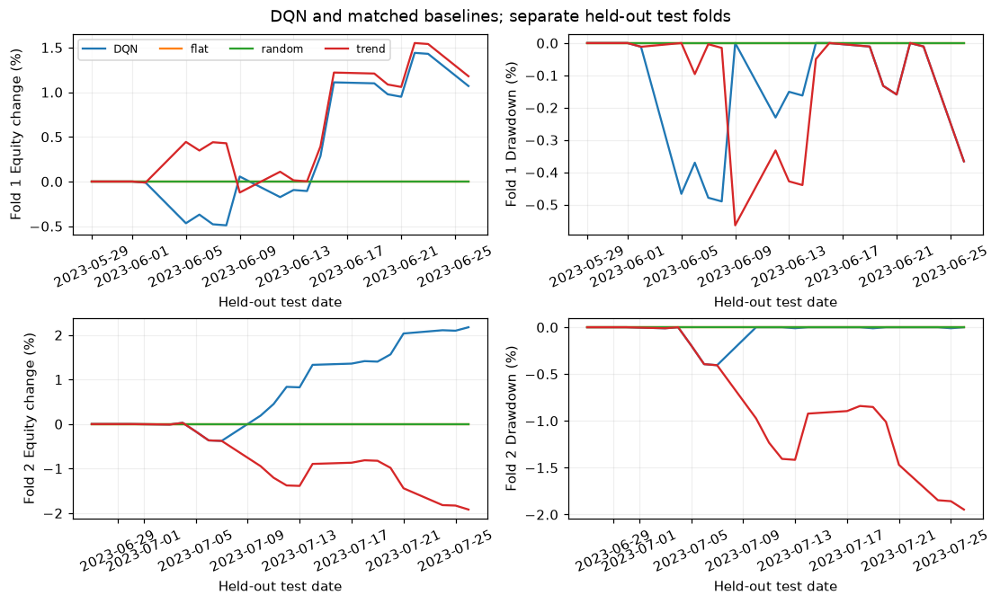
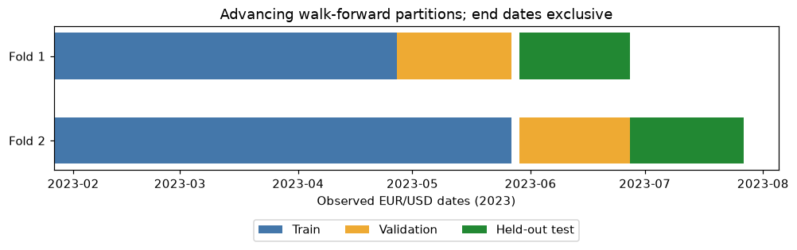
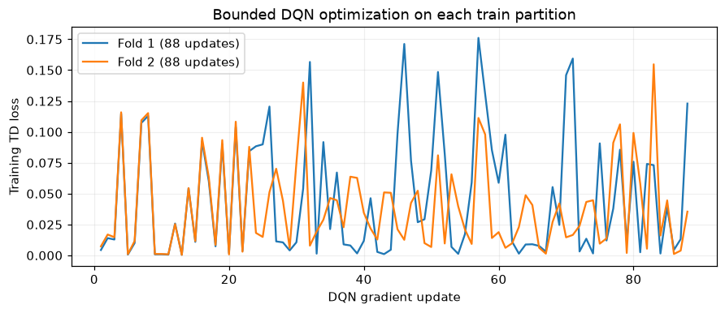

# Forex RL Simulator

**A small, inspectable demo of a larger FX reinforcement-learning research project.** The repository contains reusable trading and evaluation code plus one deliberately bounded, executed example. It is a research demonstration, not a trained production strategy or evidence of profitability.

**Models in the code:** DQN, QR-DQN, and RecurrentPPO. The published demo trains DQN only: two advancing walk-forward folds on real EUR/USD daily bars, with a separate 96-step DQN in each fold. QR-DQN and RecurrentPPO were not trained or compared in these results, and the full historical study was not run.

*Held-out, marked-to-market equity change and drawdown. Each fold starts from its own initial equity; the lines must not be joined into one portfolio history. Flat and seeded-random made no trades in these short test slices.*

## The demo in numbers

Yahoo Finance returned 151 EURUSD=X daily OHLCV bars for **2023-01-01 through 2023-08-01** (end exclusive); 132 remained after indicator warmup. The data was fetched on **2026-09-29 at 14:25 UTC** with yfinance 1.7.0. Each fold fitted its scaler on its own training period, trained a new CPU DQN, then evaluated validation and held-out test periods. The saved notebook run took **4.37 seconds** on the development laptop.

| Fold | Train / validation / test rows | Strategy | Test trades | Test total R | Test Sharpe | Test Sortino | Test max drawdown |
| --- | ---: | --- | ---: | ---: | ---: | ---: | ---: |
| 1 | 64 / 22 / 21 | DQN | 5 | 1.074 | 2.745 | 5.769 | −0.49% |
| 1 | 64 / 22 / 21 | EMA trend | 5 | 1.182 | 3.032 | 6.016 | −0.56% |
| 2 | 86 / 21 / 22 | DQN | 5 | 2.163 | 7.464 | 26.066 | −0.41% |
| 2 | 86 / 21 / 22 | EMA trend | 5 | −1.926 | −6.440 | −6.900 | −1.95% |

DQN validation total R was **−0.536** in fold 1 and **0.506** in fold 2. The report's **1.618 mean DQN test total R** is an average of two fold statistics, not a continuous portfolio return. Flat and default seeded-random each made zero test trades, so this run offers no informative empirical random-baseline comparison.

Total R sums net realized trade R-multiples. Sharpe and Sortino annualize daily marked-to-market returns at 252 periods per year; maximum drawdown uses marked-to-market equity. With only 21–22 test bars per fold, these ratios are highly unstable and should not be used as a performance claim.

## How the walk-forward check works

*Observed partitions have exclusive end dates. Within each fold, train, validation, and test rows do not overlap. Fold 2 advances the windows and retrains from scratch.*

The example uses seed 7, a 4-bar observation window, 1% position risk, a 3-bar maximum hold, a 0.0001 per-side proportional transaction cost, and a 0.00005 absolute adverse entry-price slippage. ATR-derived stops and targets apply to DQN and the flat, random, and EMA-trend baselines under the same execution engine. A decision made at a candle close cannot use that candle's earlier high or low for an exit; subsequent candles apply stop → target → time → end-of-data priority. When both stop and target lie within one bar, the stop takes priority.

The notebook calls the package's walk-forward orchestration for two folds and generates per-fold and aggregate reports. It also records a small training diagnostic:

*Each DQN completed 96 environment timesteps and 88 gradient updates. The noisy temporal-difference loss trace shows that optimization ran; it does not demonstrate convergence or out-of-sample skill.*

## Models: what was and was not compared

The package supports **DQN, QR-DQN, and RecurrentPPO**. This public demo trained **DQN only**, once per fold. It compared DQN's held-out trades with flat, seeded-random, and prior-bar EMA-trend rules. **QR-DQN and RecurrentPPO were not trained or compared** in this run. A controlled RL-model comparison would require comparable training budgets, selection rules, and more out-of-sample data.

## Run the bounded example

From the repository root, in an activated Python 3.10+ environment with internet access for Yahoo Finance:

~~~bash
python -m pip install -e ".[dev,research]"
python scripts/run_bounded_notebook.py
python -m pytest -q
~~~

The runner executes the notebook's bounded cells and saves their text and PNG outputs in [Forex_RL_Agent_Final.ipynb](Forex_RL_Agent_Final.ipynb). The figures above are small documentation copies of those saved outputs. Yahoo may revise its historical bars; the raw download is not committed, so a rerun may produce different numbers. Installing Matplotlib in a fresh environment was not independently verified in the local figure-editing session; it is declared in the research extra.

For a quick code check without downloading data or training, install the dev extra and run pytest. The tests use tiny in-memory fixtures for causal execution, long/short accounting, costs, feature alignment, fold boundaries, train-only scaling, baseline re-entry, and metrics.

## Repository map

| Path | Role |
| --- | --- |
| [src/forex_rl/data.py](src/forex_rl/data.py), [features.py](src/forex_rl/features.py), [preprocessing.py](src/forex_rl/preprocessing.py) | Fetch and prepare OHLCV data; fit transforms on training rows. |
| [environment.py](src/forex_rl/environment.py), [research.py](src/forex_rl/research.py) | Execute positions and share backtesting assumptions across agent and baselines. |
| [walk_forward.py](src/forex_rl/walk_forward.py), [evaluation.py](src/forex_rl/evaluation.py), [reporting.py](src/forex_rl/reporting.py) | Build chronological folds, calculate metrics, and emit reports. |
| [models.py](src/forex_rl/models.py), [config.py](src/forex_rl/config.py) | Optional model construction and explicit experiment settings. |
| [tests/](tests/) | Fast deterministic checks. |

The notebook is a thin demonstration of these modules. Reports from larger experiments should be kept outside version control.

## Limits of the evidence

This is one instrument, two short daily-data folds, and one tiny DQN configuration. The test windows are too small for statistical significance, generalization, or a defensible claim of alpha. The cost and OHLC execution assumptions need calibration against real spreads, slippage, and lower-frequency fill data. Repeated tuning against these same test windows would contaminate future research conclusions. Full historical walk-forward training, model selection, sensitivity analysis, and comparisons among RL model families belong to the larger project; they have **not** been verified here.

Research and education only; not investment advice.
